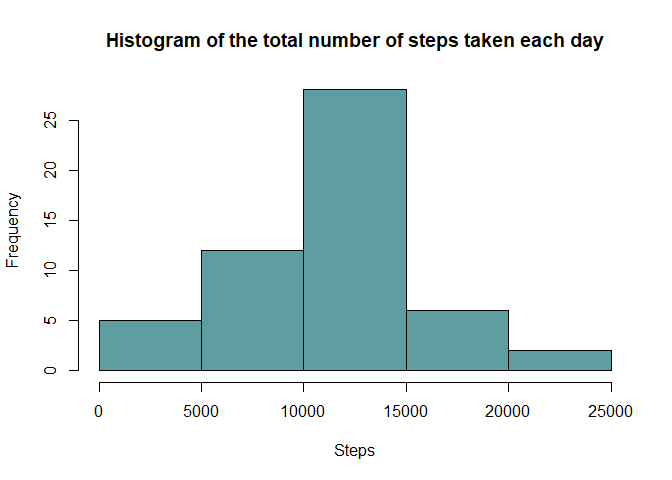
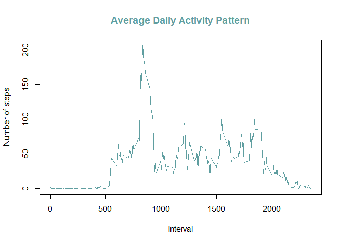
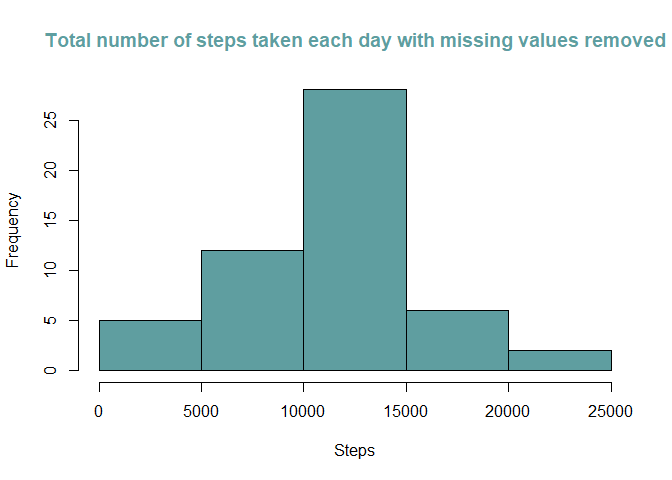
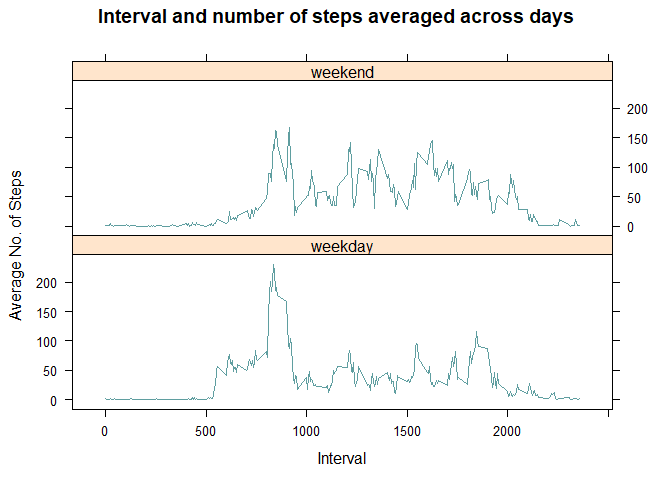

## Loading and preprocessing the data
1. Load the data (i.e. read.csv())

```r
activity<-read.csv("activity.csv")
```
2. Process/transform the data (if necessary) into a format suitable for your analysis

```r
dim(activity)
```

```
## [1] 17568     3
```

```r
names(activity)
```

```
## [1] "steps"    "date"     "interval"
```

```r
head(activity)
```

```
##   steps       date interval
## 1    NA 2012-10-01        0
## 2    NA 2012-10-01        5
## 3    NA 2012-10-01       10
## 4    NA 2012-10-01       15
## 5    NA 2012-10-01       20
## 6    NA 2012-10-01       25
```

```r
sum(is.na(activity))
```

```
## [1] 2304
```
This simply is to understand the dataset and to:  
1. Find the dimensions of the dataset.  
2. Find the column names.  
3. Look at the first few rows of data.  
4. Find number of missing data.  


## What is mean total number of steps taken per day?
1. Calculate the total number of steps taken per day

```r
steps_date <- aggregate(steps ~ date, activity, sum, na.rm=TRUE)
```
2. Make a histogram of the total number of steps taken each day

```r
hist(steps_date$steps,
     main = "Histogram of the total number of steps taken each day",
     xlab = "Steps",
     col = "cadetblue"
     )
```

<!-- -->
  
This figure shows the histogram of total number of steps taken per day.  

3. Calculate and report the mean and median of the total number of steps taken per day

```r
mean(steps_date$steps)
```

```
## [1] 10766.19
```

```r
median(steps_date$steps)
```

```
## [1] 10765
```
Mean and median of the steps.  

## What is the average daily activity pattern?

1. Make a time series plot (i.e. type = "l") of the 5-minute interval (x-axis) and the average number of steps taken, averaged across all days (y-axis)

```r
stepsinterval <- aggregate(steps~interval, activity, mean, na.rm=TRUE)
with(stepsinterval,plot(x=interval,
                        y=steps,
                        type="l",
                        main = "Average Daily Activity Pattern",
                        xlab = "Interval",
                        ylab = "Number of steps",
                        col = "cadetblue",
                        col.main = "cadetblue"))
```

<!-- -->

This figure is the time series plot of the 5-minute interval (x-axis) and the average number of steps taken, averaged across all days (y-axis)  

2. Which 5-minute interval, on average across all the days in the dataset, contains the maximum number of steps?


```r
stepsinterval[which.max(stepsinterval$steps),]
```

```
##     interval    steps
## 104      835 206.1698
```

This gives us the 5-minute interval, on average across all the days in the dataset, containing the maximum number of steps.

## Imputing missing values

1. Calculate and report the total number of missing values in the dataset (i.e. the total number of rows with NAs)

```r
sum(is.na(activity))
```

```
## [1] 2304
```

Total number of missing values in the dataset (i.e. the total number of rows with NAs)  

2. Devise a strategy for filling in all of the missing values in the dataset. The strategy does not need to be sophisticated. For example, you could use the mean/median for that day, or the mean for that 5-minute interval, etc.  

To fill in the missing values in the "steps" column, we are going to form a dataset which contains mean of steps depending on the interval. If the value of steps is missing in the data, the value is filled by the mean in accordance to the interval value.  

3. Create a new dataset that is equal to the original dataset but with the missing data filled in.


```r
activity2 <- activity
for(i in 1:nrow(activity2)){
        if(is.na(activity2[i,]$steps)){
                activity2[i,]$steps <- stepsinterval[stepsinterval$interval==activity2[i,]$interval,]$steps
        }
}
```

4. Make a histogram of the total number of steps taken each day and Calculate and report the mean and median total number of steps taken per day. Do these values differ from the estimates from the first part of the assignment? What is the impact of imputing missing data on the estimates of the total daily number of steps?

```r
steps_date2 <- aggregate(steps~date, activity2, sum)
hist(steps_date$steps,
     main = "Total number of steps taken each day with missing values removed",
     xlab = "Steps",
     col = "cadetblue",
     col.main = "cadetblue"
)
```

<!-- -->

Histogram of the total number of steps taken each day with the missing step values removed and replaced with mean steps according to the interval.


```r
mean(steps_date2$steps)
```

```
## [1] 10766.19
```

```r
median(steps_date2$steps)
```

```
## [1] 10766.19
```

The median differs from the median calculated in the first part of the assignment. The mean does not.

## Are there differences in activity patterns between weekdays and weekends?

1. Create a new factor variable in the dataset with two levels – “weekday” and “weekend” indicating whether a given date is a weekday or weekend day.


```r
activity2$date <- as.Date(strptime(activity2$date,"%Y-%m-%d"))
activity2$day <- weekdays(activity2$date)
x = c("Saturday","Sunday")
for(i in 1:nrow(activity2)){
        if(activity2[i,]$day %in% x){
                activity2[i,]$day <- "weekend"
        }
        else {
                activity2[i,]$day <- "weekday"
        }
}

unique(activity2$day)
```

```
## [1] "weekday" "weekend"
```

A new column is added which indicates whether the day is a weekend or a weekday.


```r
steps_day <- aggregate(activity2$steps ~ activity2$interval + activity2$day, activity2, mean)
names(steps_day) <- c("interval","day","steps")
```

Dataset formed by taking 5-minute interval and the average number of steps taken, averaged across all weekday days or weekend days.


```r
library(lattice)
xyplot(steps~interval|day,
       steps_day,
       type="l",
       layout = c(1,2),
       main = "Interval and number of steps averaged across days",
       xlab = "Interval",
       ylab = "Average No. of Steps",
       col = "cadetblue"
       )
```

<!-- -->

Time series plot (i.e. type = "l") of the 5-minute interval (x-axis) and the average number of steps taken, averaged across all weekday days or weekend days (y-axis)
